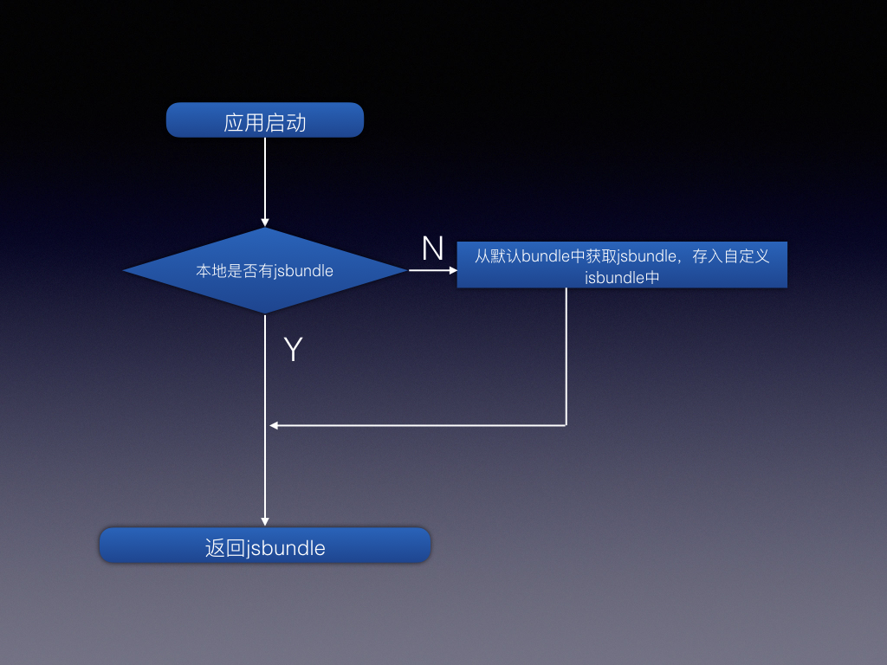

# ReactNative热更新（iOS）

文档版本0.0.1

[Author: Necfol](https://github.com/necfol)

说明: 本文档用于说明react native热更新iOS版本方案及实现，如需安卓或者其他热更新方案，不适用本文档
## 代码
[代码](https://github.com/necfol/hotUpdate/tree/master/ios)
## 目标
用户无感知情况下，下载新版本代码，于用户下一次打开应用即可使用最新业务代码

## 1、方案
### 1.1、启动应用从自定义文件中获取jsbundle
如图：

当用户打开应用时即冷启动时，判断是否有我们自定义的jsbundle文件，如果没有，则从iOS应用的mainbundle中获取，并且存入我们自定义的jsbundle中，返回自定义jsbundle。
代码：

```objc
+(NSURL *)getBundle {
  /** 每次打包之后，每一个应用程序生成一个私有目录随即生成一个数字字母串作为目录名，在每一次应用程序启动时，这个字母数字串都是不同于上一次。Documents目录可以通过：NSSearchPathForDirectoriesInDomains(NSDocumentDirectory,NSUserdomainMask，YES) 得到*/
  NSString *jsCodeLocation = [NSString stringWithFormat:@"%@/\%@",NSSearchPathForDirectoriesInDomains(NSDocumentDirectory, NSUserDomainMask, YES)[0],@"main.jsbundle"];
  BOOL jsExist = [[NSFileManager defaultManager] fileExistsAtPath:jsCodeLocation];
  if(jsExist)
    return [NSURL URLWithString:jsCodeLocation];
  NSString *jsBundlePath = [[NSBundle mainBundle] pathForResource:@"main" ofType:@"jsbundle"];
  [[NSFileManager defaultManager] copyItemAtPath:jsBundlePath toPath:jsCodeLocation error:nil];
  return [NSURL URLWithString:jsCodeLocation];
}

```

### 1.2、版本对比及下载

如图：

当应用从后台返回前台的时候，进行shouldUpdate操作，请求服务端，给予最新的版本信息，本地版本和服务端版本相比对，判断是否需要下载，如果需要下载，则下载并解压到自定义的文件中，并且将版本号更新，这样下次用户再进来，虽然代码没有更新生效，但是由于版本号升上去了，用户也不会再次下载代码。

```objc
-(void)applicationDidBecomeActive:(UIApplication *)application {
  [MICShouldUpdate shouldUpdate:^(NSInteger status, id datas) {
    if(status == 1){
      [[MICDownLoad download] downloadFileWithURLString:datas[@"zip"] callback:^(NSInteger status, id data) {
        if(status == 1){
          NSError *error;
          NSString *filePath = (NSString *)data;
          NSString *desPath = [NSString stringWithFormat:@"%@",NSSearchPathForDirectoriesInDomains(NSDocumentDirectory, NSUserDomainMask, YES)[0]];
          [SSZipArchive unzipFileAtPath:filePath toDestination:desPath overwrite:YES password:nil error:&error];
          if(!error){
            NSString *filePath = [[NSBundle mainBundle] pathForResource:@"Version" ofType:@"plist"];
            NSMutableDictionary *newsDict = [NSMutableDictionary dictionary];
            [newsDict setObject:datas[@"version"] forKey:@"version"];
            [newsDict writeToFile:filePath atomically:YES];
            NSLog(@"解压成功");
//            如果是立马更新则打开下面代码
//            [_bridge reload];
          }else{
            NSLog(@"解压失败");
          }
        }
      }];
    }
  }];
  
}

```

如果需要下载完代码立刻更新则将以下代码放开：

```
//            [_bridge reload];

```

## 2、运行时需要修改的内容

1.MICShouldUpdate.m文件中的

```
NSString *url = @"http://192.168.100.75:3000";
```
这个url地址需要改为自己的接口。返回类型为:

```
{
	version: 1.0.1,
	zip: "http://192.168.100.75:9000/main.jsbundle_1.0.1.zip"
}
```
这边的数据结构可以根据自己的需要进行修改。

## 3、todo
1.版本对比交给服务端，由服务端判断是否需要更新代码，这样带来的好处是，如果1.0.1版本不能直接升级到线上最新的版本例如1.1.9，服务端可以反回能让1.0.1版本升级的最新版本比如说1.0.5。这样就不会带来应用闪退问题。

2.使用diff-patch策略，以字节来增量更新代码
